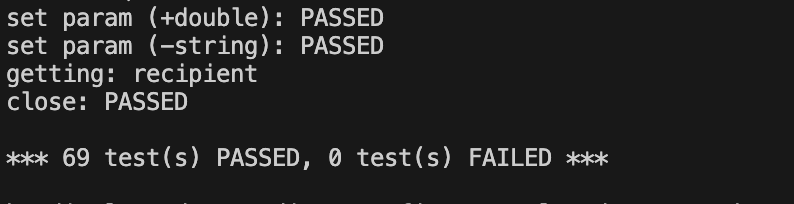
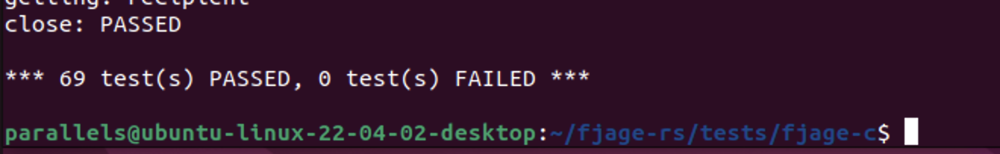
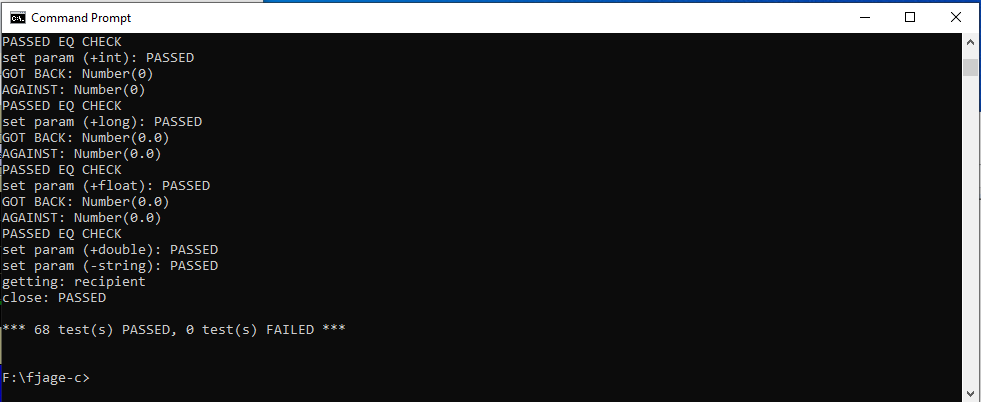
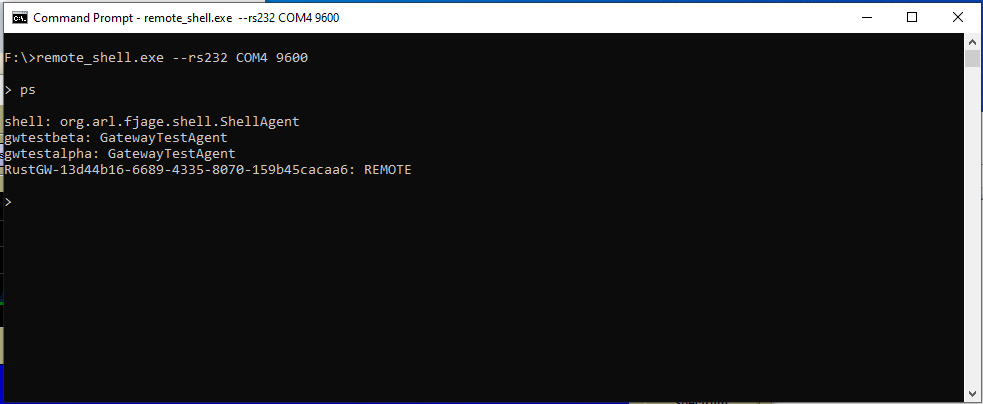

# Testing serial port/RS-232 connectivity

In order to test the Rust gateway's ability to communicate with a fjåge node over a serial connection, I needed an easy way to simulate two serial ports directly connected to each other in a loopback configuration. At first, I tried following advice on [this StackOverflow post](https://stackoverflow.com/questions/52187/virtual-serial-port-for-linux) about using [socat](https://www.redhat.com/sysadmin/getting-started-socat). I was very excited about this idea at first, as it seemed to provide a solution that would work on both macOS and Linux without too much fuss. However, I quickly discovered that this method doesn't really work for this use case. Fjåge seems to think that the serial port connection is dropped after a few seconds, and serialport-rs, which powers mio_serial, which powers tokio_serial, does not recognize it as a valid serial port on macOS and throws an error. I then moved to trying it out in a Linux VM, where tokio_serial recognized the port successfully, but fjåge still disconnected. As far as I can tell, this is due to socat not being able to emulate the lower-level details of the serial protocol as highlighted in [the repo for tty0tty](https://github.com/freemed/tty0tty). With socat not working, my other two options were tty0tty, which required compiling and installing a kernel module, and testing on actual hardware. While tty0tty probably would have worked, I was more interested in something that I could use to test on all platforms with. And with that out of the way, heres the solution I came up with for testing:

This is my son, his name is "two Raspberry Pi Debug Probes with their UARTs tied together". This is a subtle reference to him being two Raspberry Pi Debug Probes with their UARTs tied together.

In early 2023, Raspberry Pi released these low-cost debug probes based on their RP2040 ARM SoCs. In addition to providing JTAG debugging, they provide a grounded UART port which is perfect for this use case. By wiring TX to RX, RX to TX, and GND to GND, we can create a serial port loopback that will allow us to accurately simulate the communication of two devices connected over serial. 

# Testing on macOS
When enumerated on macOS, they showed up for me as `/dev/tty.usbmodem102` and `/dev/tty.usbmodem1102`. I began by running a fjåge node with `./fjage.sh -rs232 /dev/tty.usbmodem1102 -baud 9600`, making sure that I had edited initrc.groovy to load the dummy agent that the modified C API test relies on, and then ran `./test_fjage /dev/tty.usbmodem102`. Once the test had finished, I was happy to see that serial port functionality was working well under macOS:

# Testing on Linux
The procedure I used for testing on Linux was to continue running fjåge on macOS attached to one of the debug probes, while passing the other debug probe through to a Linux VM using USB passthrough. I then ran `./test_fjage` in the same manner as before, but using `/dev/ttyACM0`, the mounting point for the debug probe in the Linux VM. I was again happy to see that all of the tests were passing for a serial port connection on Linux:

# Testing on Windows
Testing on Windows was a bit more difficult. It's possible that something was not working right in my setup, but I could not get communication between my Windows machine and the fjåge container working over the Raspberry Pi Debug Probes. I will probably try this again sometime, because I think there were some gaps in my testing methods, but I did ultimately get serial port communication working on Windows machine using two FTDI cables wired together in a similar manner as the debug probes. Here's the result of the tests passing, as well as a demonstration of the remote shell program running on Windows:

